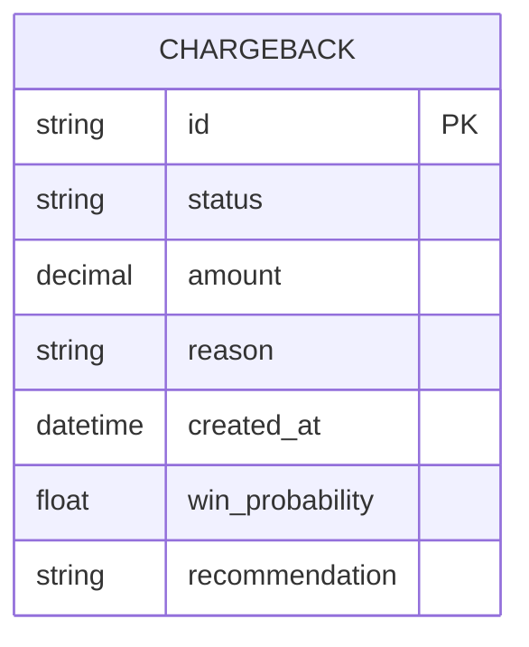

# Arquitetura — Gestão de Chargebacks (Protótipo Navegável)

**Versão:** 1.0
**Data:** 2026-02-21
**PRD Ref:** 01-PRD v1.0

---

## 1. Stack Tecnológica

| Camada       | Tecnologia | Versão | Justificativa |
|--------------|------------|--------|---------------|
| Frontend     | React com Vite | Última | Rapidez no desenvolvimento do protótipo e facilidade na componentização. |
| Linguagem    | TypeScript  | Última | Segurança de tipos, previne erros e melhora o autocompletar. |
| Estilização  | Vanilla CSS | Última | Flexibilidade máxima para ser 100% fidedigno aos prints, conforme restrições de tecnologia (sem Tailwind a menos que estritamente necessário). |
| Roteamento   | React Router| v6+    | Para simular navegabilidade real entre as diferentes telas do protótipo. |
| Mock de Dados| Frontend    | N/A    | Dados estáticos e mockados (JSON) no próprio frontend para simular a aplicação final. |

---

## 2. Arquitetura Geral

Como o objetivo é construir um protótipo navegável de alta fidelidade sem backend real no primeiro momento, a arquitetura é focada inteiramente no SPA (Single Page Application) servido estaticamente. Toda a lógica de "busca de dados" será emulada através de serviços mock que leem arquivos JSON locais ou estruturas de dados contendo as informações simuladas.

```mermaid
graph TD
    A[Usuário/Browser] --> B[React (Vite) Application]
    B --> C[Page Components]
    C --> D[Shared UI Components]
    C --> E[Mock Data Services]
```

---

## 3. Estrutura de Pastas

```
Gestão de chargebacks/
├── src/
│   ├── assets/
│   │   ├── images/
│   │   └── icons/
│   ├── components/
│   │   ├── layout/
│   │   └── ui/           # Botões, Tabelas, Cards
│   ├── pages/            # Telas principais abordadas nos Prints
│   ├── services/         # Mock services
│   ├── styles/           # Vanilla CSS globais e módulos
│   ├── types/            # Tipagens TypeScript
│   ├── App.tsx
│   └── main.tsx
├── docs/
│   ├── 01-PRD.md
│   ├── 02-ARCHITECTURE.md
│   ├── 03-SPEC.md
│   └── 04-IMPLEMENTATION-PLAN.md
├── index.html
├── package.json
├── tsconfig.json
└── vite.config.ts
```

---

## 4. Modelagem de Dados (Mocks)



### Detalhamento das Entidades

#### CHARGEBACK (Em memória)
| Campo | Tipo | Descrição |
|---|---|---|
| id | string | Identificador único da disputa |
| status | string | Status (Pendente, Respondido, Ganho, Perdido) |
| amount | number | Valor em Reais (R$) contestado |
| recommendation | string | 'accept' ou 'dispute' (Vem do Motor de Decisão) |

---

## 5. Padrões e Convenções

### Nomenclatura
| Item          | Padrão        | Exemplo              |
|---------------|---------------|----------------------|
| Componentes UI| PascalCase    | `Button.tsx` / `Dashboard.tsx` |
| Estilos (CSS) | kebab-case    | `button.css` ou `dashboard.module.css` |
| Funções       | camelCase     | `formatCurrency`     |

### Layouts e Medidas
- Deve seguir exatamente as proporções, cores e tipografia existentes na pasta `Prints/`.
- Usar variáveis CSS (`:root`) para cores globais e fontes para manter consistência em toda a aplicação.

---

## 6. Integrações Externas

- **Nenhuma para o protótipo.** Toda a simulação de respostas da API (como score de vitória da Koin e relatórios do motor de decisão) deve ocorrer localmente.

---

## 7. Estratégia de Testes

- Foco na Validação Visual: O protótipo não requer testes automatizados complexos (unitários/e2e) neste estágio, mas a validação manual ("Done When") exige que cada tela renderizada corresponda aos Prints de forma "pixel perfect".

---

*Documento criado em 2026-02-21.*
