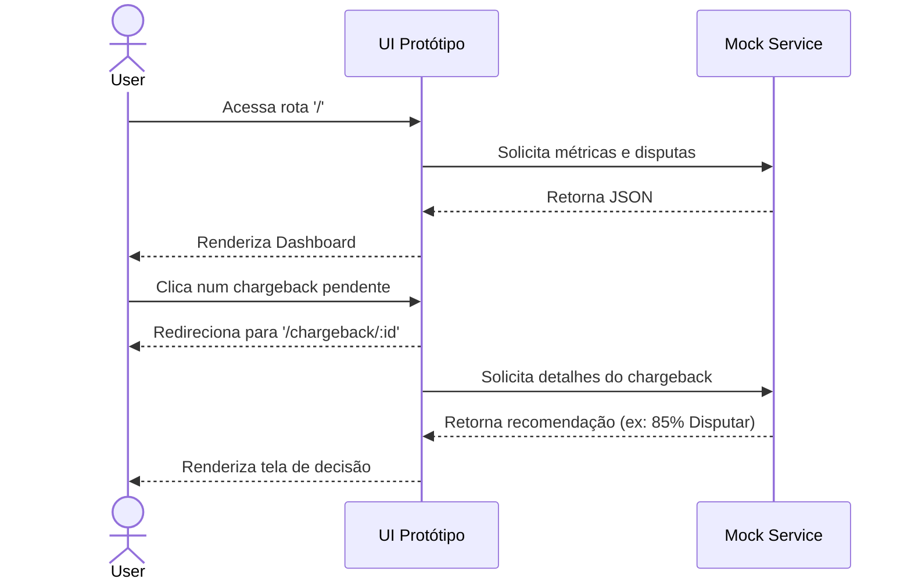

# Especificação Técnica — Gestão de Chargebacks (Protótipo Navegável)

**Versão:** 1.0
**Data:** 2026-02-21
**PRD Ref:** 01-PRD v1.0
**Arquitetura Ref:** 02-ARCHITECTURE v1.0

---

## 1. Resumo das Mudanças

Criação de um protótipo estático (SPA) em React+Vite para simular a aplicação final de Gestão de Chargebacks. Esse protótipo utilizará mock data para todas as métricas e listagens.

### Escopo desta Iteração
- Inicialização do projeto base React (Vite, TS).
- Estruturação global de estilos (CSS) baseada nas imagens de referência.
- Módulo Dashboard (Métricas + Listagem).
- Módulo Detalhes de Disputa (Recomendação do Motor de Decisão).
- Módulo Geração de Evidências.

---

## 2. Detalhamento Técnico

### Feature: [RF-001/002] Dashboard Central

#### 2.1 Descrição Técnica
O Dashboard será a página inicial (`/`). Ele irá buscar (mock) os dados de métricas (Win rate, valor recuperado) e a lista dos chargebacks mais recentes, exibindo-os numa tabela ou lista.

#### 2.2 Arquivos

| Ação      | Caminho                              | Descrição            |
|-----------|--------------------------------------|----------------------|
| Criar     | `src/pages/Dashboard/index.tsx`      | Tela Principal       |
| Criar     | `src/pages/Dashboard/Dashboard.css`  | Estilos específicos  |
| Criar     | `src/components/ui/MetricsCard.tsx`  | Componente de KPI    |
| Criar     | `src/components/ui/ChargebackTable.tsx` | Tabela de disputas |
| Criar     | `src/services/mockData.ts`           | Dados fakes (JSON)   |

#### 2.3 Interfaces / Types

```typescript
interface ChargebackMetric {
  title: string;
  value: string;
  trend?: "up" | "down" | "neutral";
}

interface ChargebackListItem {
  id: string;
  merchantName: string;
  amount: number;
  date: string;
  status: "Pendente" | "Respondido" | "Perdido" | "Ganho";
  actionRequired: boolean;
}
```

---

### Feature: [RF-003/004] Detalhes do Chargeback & Decisão

#### 2.1 Descrição Técnica
Tela (`/chargeback/:id`) contendo os detalhes da disputa e o card de "Recomendação do Motor de Decisão" (ex: Score de vitória de 85% -> Disputar).

#### 2.2 Arquivos

| Ação      | Caminho                              | Descrição            |
|-----------|--------------------------------------|----------------------|
| Criar     | `src/pages/ChargebackDetail/index.tsx` | Tela de detalhes   |
| Criar     | `src/pages/ChargebackDetail/Detail.css`| Estilos            |
| Criar     | `src/components/ui/DecisionEngine.tsx` | Card de recomendação API simulada |

#### 2.3 Interfaces / Types

```typescript
interface DecisionRecommendation {
  score: number; // 0 a 100
  action: "dispute" | "accept";
  reasons: string[];
}
```

---

## 3. Componentes de UI (Shared)

### Componente: Button
| Prop       | Tipo        | Obrigatório | Default | Descrição       |
|------------|-------------|-------------|---------|-----------------|
| variant    | "primary" \| "secondary" \| "danger" | Não | "primary" | Estilo vindo dos prints |
| children   | ReactNode   | Sim         | —       | Texto ou ícone  |
| onClick    | function    | Não         | —       | Ação de clique  |

### Componente: StatusBadge
| Prop       | Tipo        | Obrigatório | Default | Descrição       |
|------------|-------------|-------------|---------|-----------------|
| status     | string      | Sim         | —       | Ex: "Pendente", "Ganho" |

---

## 4. Fluxos Críticos do Protótipo

### Fluxo: Navegação Principal



---

## 5. Casos de Borda (No escopo do Protótipo)

| # | Cenário                          | Comportamento Esperado                    |
|---|----------------------------------|-------------------------------------------|
| 1 | Rota não existente (`/abc`)      | Exibir tela genérica 404.                 |
| 2 | ID de chargeback não listado no mock | Exibir tela de "Chargeback não encontrado" ou fallback gracioso. |

---

*Documento criado em 2026-02-21.*
